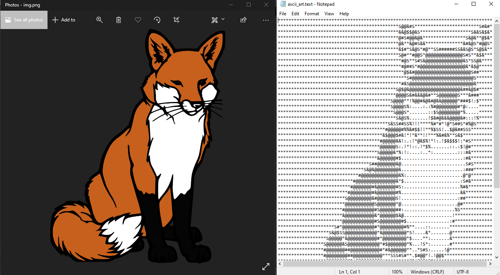
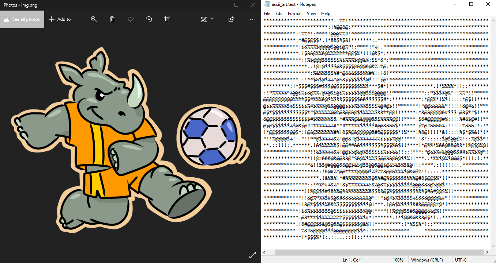

Image To ASCII Art Using Python

## Description

Image To ASCII Art converter using Python with the use of PyWhatKit Module.




### Prerequisites

You need python 3 and pip to install and use this on your machine.
```
pip install pywhatkit
```

### Executing program

* Download the project
* Extract the files 
* Open the .py file in any Python IDE.
* Replace source and target path
* Run the Program. 

## Version History

* 1.0
    * Initial Release
