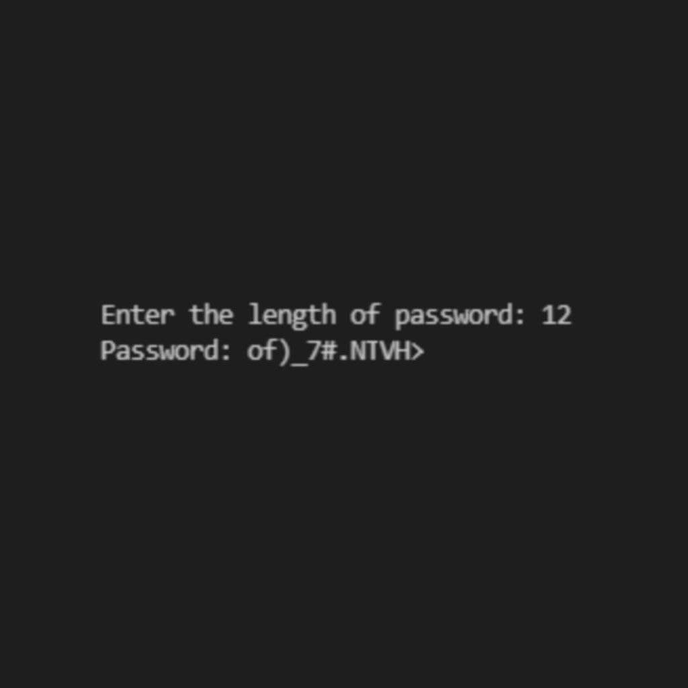

Password Generator Using Python

## Description

Password Generator using Python with the use of String and Random Module.

### Prerequisites

You need python 3 to use this on your machine.

### Executing program

* Download the project
* Run the Program. 
* Enter the length of Password.
* Password will be generated. 

## Version History

* 1.0
    * Initial Release
